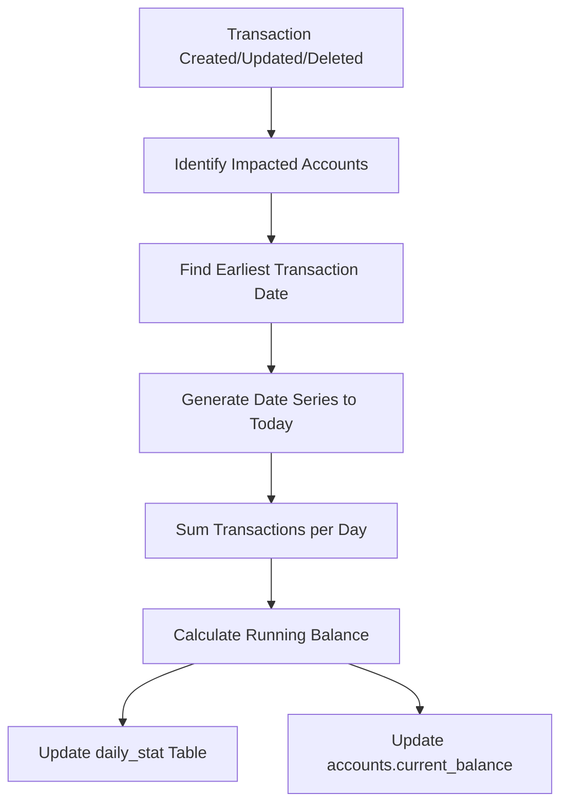

# Balance Tracking

How account balances are calculated, stored, and maintained.

## Balance Storage

Account balances are stored in two places:

| Location | Field | Purpose |
|----------|-------|---------|
| `accounts` table | `current_balance` | Current account balance |
| `daily_stat` table | `amount` | Running balance at end of each day |

## Balance Calculation Flow



## Transaction Impact Detection

When a transaction changes, the system identifies all impacted accounts:

```go
// For each transaction, both accounts are impacted
accounts := []int32{
    tx.SourceAccountID,
    tx.DestinationAccountID,
}
```

**Code Reference:** `pkg/transactions/stats.go:28-35`

## Daily Statistic Recalculation

### Step 1: Determine Start Date

The recalculation starts from the earlier of:
1. The transaction date being processed
2. The latest existing daily_stat record before that date

```sql
SELECT LEAST(
    @startDate,
    (SELECT date FROM daily_stat
     WHERE account_id = @accountID AND date < @startDate
     ORDER BY date DESC LIMIT 1)
)
```

### Step 2: Generate Date Series

Creates a continuous series of dates from start to today:

```sql
generate_series(min_date, GREATEST(NOW()::DATE, max_tx_date) + 1, '1 day')
```

### Step 3: Sum Daily Transactions

For each date, sum all transaction amounts for the account:

```sql
SELECT
    transaction_date_only as tx_date,
    SUM(
        CASE
            WHEN source_account_id = @accountID THEN source_amount
            ELSE destination_amount
        END
    ) as amount
FROM transactions
WHERE (source_account_id = @accountID OR destination_account_id = @accountID)
  AND deleted_at IS NULL
GROUP BY transaction_date_only
```

### Step 4: Calculate Running Balance

Uses window function to compute cumulative balance:

```sql
SELECT
    date,
    SUM(daily_amount + initial_balance) OVER (
        ROWS BETWEEN UNBOUNDED PRECEDING AND CURRENT ROW
    ) as running_balance
FROM date_series
```

### Step 5: Update Tables

1. **daily_stat**: Upsert running balance for each date
2. **accounts.current_balance**: Set to latest running balance

```sql
-- Update daily_stat
INSERT INTO daily_stat(account_id, date, amount)
SELECT @accountID, date, amount
FROM running
ON CONFLICT ON CONSTRAINT daily_stat_pk
DO UPDATE SET amount = excluded.amount;

-- Update current_balance
UPDATE accounts
SET current_balance = (SELECT amount FROM latest_running),
    last_updated_at = NOW()
WHERE id = @accountID;
```

**Code Reference:** `pkg/transactions/scripts/daily_recalculate.sql`

## Amount Selection Logic

Which amount field is used depends on the account's role:

| Account Role | Amount Field Used |
|--------------|-------------------|
| Source account | source_amount |
| Destination account | destination_amount |

```sql
CASE
    WHEN source_account_id = @accountID THEN source_amount
    ELSE destination_amount
END
```

## Balance at Any Date

To get account balance at a specific date, use daily_stat:

```sql
SELECT amount as balance_at_date
FROM daily_stat
WHERE account_id = :account_id
  AND date <= :target_date
ORDER BY date DESC
LIMIT 1;
```

Or sum all daily changes up to that date:

```sql
SELECT SUM(amount) as balance
FROM daily_stat
WHERE account_id = :account_id
  AND date <= :target_date;
```

**Note:** The `amount` field in daily_stat is a **running total**, not a daily change.

## Net Worth Calculation

Sum asset balances minus liability balances:

```sql
SELECT
    SUM(CASE WHEN type = 1 THEN current_balance ELSE 0 END) as total_assets,
    SUM(CASE WHEN type = 4 THEN current_balance ELSE 0 END) as total_liabilities,
    SUM(CASE WHEN type = 1 THEN current_balance ELSE 0 END) -
    SUM(CASE WHEN type = 4 THEN current_balance ELSE 0 END) as net_worth
FROM accounts
WHERE type IN (1, 4)
  AND deleted_at IS NULL;
```

## Net Worth Over Time

Using daily_stat for historical net worth:

```sql
WITH daily_balances AS (
    SELECT
        ds.date,
        a.type,
        ds.amount as balance
    FROM daily_stat ds
    JOIN accounts a ON a.id = ds.account_id
    WHERE a.type IN (1, 4)  -- Asset, Liability
      AND a.deleted_at IS NULL
)
SELECT
    date,
    SUM(CASE WHEN type = 1 THEN balance ELSE 0 END) -
    SUM(CASE WHEN type = 4 THEN balance ELSE 0 END) as net_worth
FROM daily_balances
GROUP BY date
ORDER BY date;
```

## Cache Strategy

The StatService uses an LRU cache to optimize repeated calculations:

```go
type StatService struct {
    noGapTillTime *expirable.LRU[string, time.Time]
}
```

Cache entries expire after 10 minutes.

**Code Reference:** `pkg/transactions/stats.go:22-26`

## Triggers for Recalculation

Balance recalculation occurs when:

1. **Transaction created** - Both source and destination accounts
2. **Transaction updated** - Both old and new accounts if changed
3. **Transaction deleted** - Both affected accounts

## Performance Considerations

### Why Pre-compute?

- Direct balance calculation would require scanning all transactions
- Daily stats enable O(1) current balance lookups
- Historical balance queries are efficient with indexed daily_stat

### Date Range Optimization

The system only recalculates from the earliest affected date forward:

```go
impactedAccounts := map[int32]time.Time{} // account -> earliest affected date

for _, tx := range newTxs {
    for _, accountID := range getAccountsForTx(tx) {
        if existing, ok := impactedAccounts[accountID]; !ok {
            impactedAccounts[accountID] = tx.TransactionDateTime
        } else if existing.After(tx.TransactionDateTime) {
            impactedAccounts[accountID] = tx.TransactionDateTime
        }
    }
}
```

## Common Queries

### Account Balance History

```sql
SELECT date, amount as balance
FROM daily_stat
WHERE account_id = :account_id
ORDER BY date DESC
LIMIT 30;
```

### Accounts with Recent Activity

```sql
SELECT DISTINCT a.id, a.name, MAX(ds.date) as last_activity
FROM accounts a
JOIN daily_stat ds ON ds.account_id = a.id
WHERE a.deleted_at IS NULL
GROUP BY a.id, a.name
HAVING MAX(ds.date) >= CURRENT_DATE - INTERVAL '7 days'
ORDER BY last_activity DESC;
```

### Balance Verification

Compare current_balance with daily_stat:

```sql
SELECT
    a.id,
    a.name,
    a.current_balance,
    ds.amount as stat_balance,
    a.current_balance - ds.amount as difference
FROM accounts a
LEFT JOIN (
    SELECT DISTINCT ON (account_id) account_id, amount
    FROM daily_stat
    ORDER BY account_id, date DESC
) ds ON ds.account_id = a.id
WHERE a.deleted_at IS NULL
  AND a.current_balance != COALESCE(ds.amount, 0);
```

If this returns rows, there's a data integrity issue.

## Data Integrity

The system ensures:

1. **No gaps**: Every day from first transaction to today has a daily_stat entry
2. **Consistency**: current_balance always matches latest daily_stat amount
3. **Atomicity**: Balance updates happen within transaction
4. **Soft deletes respected**: Deleted transactions excluded from calculations
