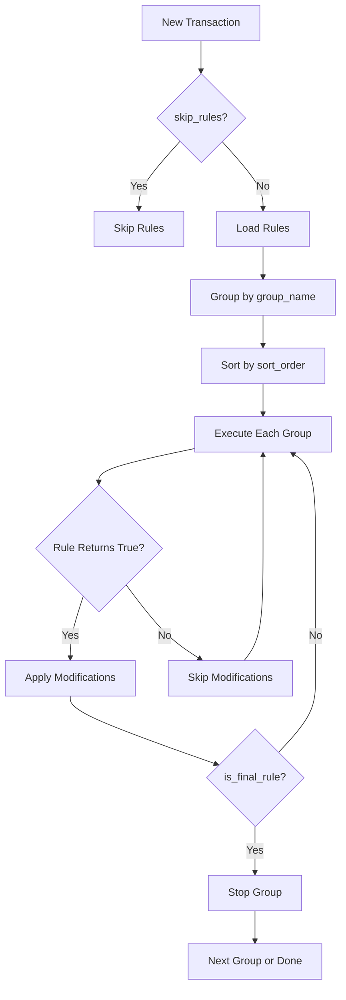

# Rules Engine

Automated transaction modification using Lua scripts.

## Purpose

The rules engine allows automatic modification of transactions during creation:
- Auto-categorization based on title/notes
- Account reassignment based on patterns
- Tag application
- Amount adjustments
- Currency conversion

## Processing Flow



## Rule Table Schema

| Column | Type | Description |
|--------|------|-------------|
| id | integer | Primary key |
| title | text | Human-readable name |
| script | text | Lua script content |
| interpreter_type | integer | 1 = Lua |
| group_name | text | Logical grouping |
| sort_order | integer | Execution order within group |
| enabled | boolean | Whether rule is active |
| is_final_rule | boolean | Stop group if this rule matches |
| created_at | timestamp | Creation time |
| updated_at | timestamp | Last modification |
| deleted_at | timestamp | Soft delete |

## Rule Grouping and Ordering

Rules are organized into groups and executed in order:

1. **Group by `group_name`**: Rules with same group_name are processed together
2. **Sort groups alphabetically**: Groups execute A-Z
3. **Sort within group by `sort_order`**: Lower numbers execute first

```go
// Fetch rules
rules := db.Order("sort_order asc").Find(&rules)

// Group by group_name
ruleGroups := map[string]*RuleGroup{}
for _, rule := range rules {
    ruleGroups[rule.GroupName].Rules = append(..., rule)
}

// Sort group names
groupNames := sort.Strings(keys(ruleGroups))
```

**Code Reference:** `pkg/transactions/rules/executor.go:110-148`

## is_final_rule Behavior

When `is_final_rule = true`:
- If the rule returns `true` (modifies transaction)
- Processing stops for the current group
- Next group continues processing

This enables "first match wins" logic within a group.

## Lua Transaction API

Scripts access and modify transactions via the `tx` global object:

### Read/Write Fields

| Method | Description |
|--------|-------------|
| `tx:title()` / `tx:title("new")` | Get/set transaction title |
| `tx:notes()` / `tx:notes("new")` | Get/set notes |
| `tx:sourceAccountID()` / `tx:sourceAccountID(123)` | Get/set source account |
| `tx:destinationAccountID()` / `tx:destinationAccountID(456)` | Get/set destination account |
| `tx:categoryID()` / `tx:categoryID(789)` | Get/set category |
| `tx:sourceCurrency()` / `tx:sourceCurrency("USD")` | Get/set source currency |
| `tx:destinationCurrency()` / `tx:destinationCurrency("EUR")` | Get/set destination currency |
| `tx:transactionType()` / `tx:transactionType(3)` | Get/set type (1-5) |
| `tx:referenceNumber()` / `tx:referenceNumber("REF123")` | Get/set reference |

### Amount Methods

| Method | Description |
|--------|-------------|
| `tx:sourceAmount()` | Get source amount (number) |
| `tx:sourceAmount(100.50)` | Set source amount |
| `tx:destinationAmount()` | Get destination amount |
| `tx:destinationAmount(100.50)` | Set destination amount |
| `tx:getSourceAmountWithDecimalPlaces(2)` | Get formatted amount |
| `tx:getDestinationAmountWithDecimalPlaces(2)` | Get formatted amount |

### Tag Methods

| Method | Description |
|--------|-------------|
| `tx:getTags()` | Get all tag IDs as table |
| `tx:addTag(5)` | Add tag by ID |
| `tx:removeTag(5)` | Remove tag by ID |
| `tx:removeAllTags()` | Clear all tags |

### Reference Number Methods

| Method | Description |
|--------|-------------|
| `tx:getInternalReferenceNumbers()` | Get reference numbers table |
| `tx:addInternalReferenceNumber("ref")` | Add reference |
| `tx:removeInternalReferenceNumber("ref")` | Remove reference |
| `tx:setInternalReferenceNumbers({"a", "b"})` | Replace all |

### Date/Time Methods

| Method | Description |
|--------|-------------|
| `tx:transactionDateTimeAddDate(days)` | Add days to transaction date |
| `tx:transactionDateTimeSetTime(hour, min, sec)` | Set time component |

**Code Reference:** `pkg/transactions/rules/lua_wrapper.go`, `lua_wrapper_amounts.go`, `lua_tags.go`, `lua_wrapper_date.go`

## Helper Functions

Scripts have access to helper functions via the `helpers` global:

### getAccountByID

Fetch account details by ID:

```lua
local account = helpers:getAccountByID(123)
print(account.Name)
print(account.Currency)
print(account.Type)
```

### convertCurrency

Convert amounts between currencies:

```lua
local usdAmount = helpers:convertCurrency("EUR", "USD", 100)
-- Returns 117.25 if EUR rate = 0.8529
```

**Code Reference:** `pkg/transactions/rules/lua_helpers.go`

## Rule Return Value

Rules signal modification via the `tx.modified` flag:
- If any setter method is called, `modified = true`
- Rule returns `modified` to executor
- If `true`, cloned transaction with modifications is used
- If `false`, original transaction is unchanged

```go
func (l *LuaInterpreter) Run(ctx context.Context, script string, tx *Transaction) (bool, error) {
    wrapped := &LuaTransactionWrapper{tx: tx}
    // ... execute script ...
    return wrapped.modified, nil
}
```

## Example Rules

### Auto-Categorize by Title Pattern

```lua
-- Rule: Grocery stores → Groceries category (ID: 10)
local title = tx:title()
if string.match(string.lower(title), "grocery") or
   string.match(string.lower(title), "supermarket") or
   string.match(string.lower(title), "walmart") then
    tx:categoryID(10)  -- Groceries category
    tx:addTag(5)       -- "Groceries" tag
end
```

### Convert Foreign Currency Amount

```lua
-- Rule: Convert EUR expenses to USD
if tx:sourceCurrency() == "EUR" and tx:transactionType() == 3 then
    local eurAmount = tx:sourceAmount()
    local usdAmount = helpers:convertCurrency("EUR", "USD", eurAmount)
    tx:sourceAmount(usdAmount)
    tx:sourceCurrency("USD")
end
```

### Route by Account Currency

```lua
-- Rule: Route to correct currency account
local destAccount = helpers:getAccountByID(tx:destinationAccountID())
if destAccount.Currency ~= tx:sourceCurrency() then
    -- Find account with matching currency
    if tx:sourceCurrency() == "EUR" then
        tx:destinationAccountID(456)  -- EUR account
    elseif tx:sourceCurrency() == "USD" then
        tx:destinationAccountID(789)  -- USD account
    end
end
```

### Tag Based on Amount

```lua
-- Rule: Tag large purchases
if tx:transactionType() == 3 and tx:destinationAmount() > 100 then
    tx:addTag(7)  -- "Large Purchase" tag
end
```

## Dry Run Testing

Rules can be tested without persisting changes:

```go
dryRunService.ProcessWithRules(ctx, &DryRunRequest{
    Transaction: tx,
    Rules:       []*Rule{testRule},
})
```

**Code Reference:** `pkg/transactions/rules/dry_run.go`

## SQL Queries

### All Active Rules

```sql
SELECT id, title, group_name, sort_order, is_final_rule
FROM rules
WHERE enabled = true
  AND deleted_at IS NULL
ORDER BY group_name, sort_order;
```

### Rules by Group

```sql
SELECT id, title, sort_order, is_final_rule
FROM rules
WHERE group_name = :group_name
  AND enabled = true
  AND deleted_at IS NULL
ORDER BY sort_order;
```

### Rule Execution Order

```sql
SELECT
    group_name,
    title,
    sort_order,
    is_final_rule
FROM rules
WHERE enabled = true
  AND deleted_at IS NULL
ORDER BY group_name, sort_order;
```

## Performance Considerations

1. **Rule Cloning**: Transaction is deep-cloned before each rule for isolation
2. **Early Exit**: `is_final_rule` stops unnecessary processing
3. **LRU Cache**: Frequently accessed accounts can be cached
4. **Disabled Rules**: Filtered at query time, not runtime

## Best Practices

1. **Use Groups**: Organize related rules into logical groups
2. **Order Carefully**: Lower sort_order = higher priority within group
3. **Use is_final_rule**: Prevent redundant processing when first match is enough
4. **Handle Errors**: Lua errors stop transaction processing
5. **Test with Dry Run**: Validate rules before enabling
6. **Clear Titles**: Name rules descriptively for debugging

## Transaction Type Values

For use in `tx:transactionType()`:

| Value | Type |
|-------|------|
| 1 | Transfer |
| 2 | Income |
| 3 | Expense |
| 5 | Adjustment |

## Skipping Rules

Rules can be skipped for a transaction:
- Set `skip_rules = true` in the create request
- Useful for imports or manual corrections
