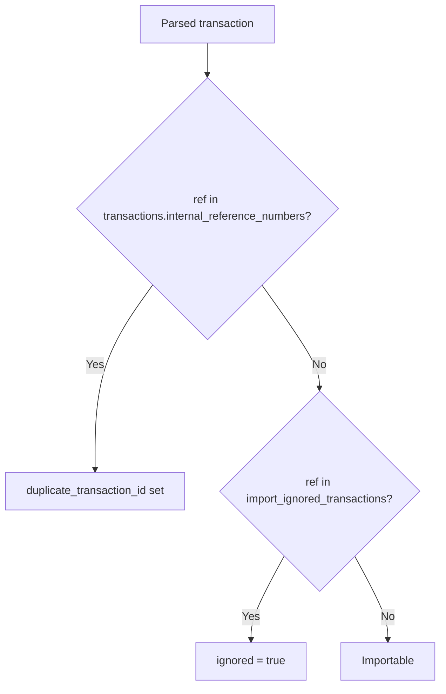

# Import Deduplication

How statement imports detect and skip transactions that should not be created again.

## Reference-Number Dedup

Every parsed transaction gets a stable dedup key:

```
{ImportSource}_{murmurhash3(raw)}
```

Computed in `pkg/importers/common.go` (`toKey` / `ToCreateRequests`) and stored on
each created transaction as `internal_reference_numbers` (a `text[]` with a GIN index).

On parse, `Importer.CheckDuplicates` (`pkg/importers/importer.go`) overlaps the parsed
keys against `transactions.internal_reference_numbers`. A match sets
`DeduplicationItem.DuplicationTransactionID`, surfaced to the client as
`ParsedTransaction.duplicate_transaction_id`. Re-importing the same statement therefore
detects already-created rows.

## Skip & Remember (User-Marked Ignore)

Some parsed rows are not real duplicates but the user never wants them created (noise,
non-transactional lines, etc.). On the import review screen the user can mark such a row
as "skip & remember". This persists the row's ref key so it is treated as a duplicate on
every future parse of the same statement.

### `import_ignored_transactions`

Migration `2026-05-16-AddImportIgnoredTransactions` (`pkg/database/migrations.go`),
model `database.ImportIgnoredTransaction` (`pkg/database/import_ignored.go`):

| Column | Type | Notes |
|--------|------|-------|
| import_source | integer NOT NULL | `ImportSource` enum |
| ref_key | text NOT NULL | the dedup key |
| reason | text | nullable; no UI in v1 |
| created_at | timestamp NOT NULL | |

- Primary key: `(import_source, ref_key)`
- Secondary index: `ix_import_ignored_transactions_ref_key` on `ref_key`

### `MarkTransactionsIgnored` RPC

```
ImportService.MarkTransactionsIgnored(
  MarkTransactionsIgnoredRequest{ import_source, repeated reference_numbers, optional reason }
) -> MarkTransactionsIgnoredResponse{ ignored_count }
```

- Service: `Importer.MarkTransactionsIgnored` (`pkg/importers/importer.go`) — trims and
  de-duplicates incoming refs, returns sentinel `importers.ErrNoReferenceNumbers` if none
  remain, then inserts idempotently with `ON CONFLICT DO NOTHING`.
- Handler: `cmd/server/internal/handlers/import.go` — JWT-guarded;
  `ErrNoReferenceNumbers` → `connect.CodeInvalidArgument`, any other error →
  `CodeInternal`.
- `ignored_count` counts rows **newly inserted** (conflicts excluded). Re-marking an
  already-ignored ref returns `ignored_count == 0`.

### Lookup on Parse

`CheckDuplicates` additionally queries `import_ignored_transactions` by `ref_key` only
(no source filter — ref keys embed the source, so cross-source collisions are effectively
impossible; this mirrors the existing `internal_reference_numbers` overlap query). A hit
sets `DeduplicationItem.Ignored = true`, surfaced as the new proto field
`ParsedTransaction.ignored` (proto3 bool, field 3).

## Parse → Dedup Decision



## UI Behaviour

`frontend/src/app/pages/transactions/transactions-import.component.*`:

- A per-row "Skip & remember" button shows only on non-duplicate, non-error rows; it
  calls `markTransactionsIgnored`.
- An `isDuplicate(item)` predicate folds `ignored` into the existing DUPLICATE handling.
  A remembered skip comes back on future parses as the orange **DUPLICATE** badge — but
  with no "View #id" link, since there is no backing transaction. It is auto-deselected
  and counted under "Hide Duplicates".

## Direct (Non-Staging) Import

`Importer.Import` skips items where `DuplicationTransactionID != nil || Ignored` and
counts them together in `ImportTransactionsResponse.duplicate_count`. There is no
separate ignored counter in v1.

## Un-ignore (Manual)

There is no un-ignore UI in v1. To reverse a remembered skip, delete the row directly:

```sql
delete from import_ignored_transactions where ref_key = '<key>';
-- optionally also: and import_source = <n>
```

## Deferred (v1)

- No un-ignore UI.
- `reason` column/field exist but have no UI.
- Per-row only — no bulk mark.
- The legacy orphaned `import_deduplication` table is unrelated and left untouched.

---

## See Also

- [Transaction Overview](overview.md) - Processing pipeline
- [Transaction Types](types.md) - Type-specific behavior
- [Schema Quick-Ref](../../schema/QUICK-REF.md) - `import_ignored_transactions` row
