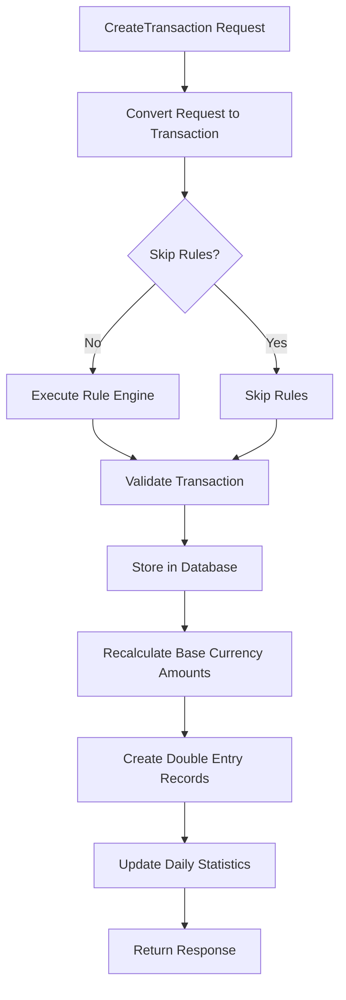

# Transaction Processing Overview

This document describes the complete transaction processing pipeline in Go Money.

## Transaction Creation Flow



## Processing Steps

### 1. Request Conversion

The incoming request is converted to a database transaction:

```
CreateTransactionRequest → database.Transaction
```

Based on transaction type, different fill methods are called:
- `fillTransferBetweenAccounts` - For transfers
- `FillDeposit` - For income
- `FillWithdrawal` - For expenses
- `fillReconciliation` - For adjustments

**Code Reference:** `pkg/transactions/service.go:242-311`

### 2. Rule Engine Processing

If `skip_rules = false`, the rule engine processes the transaction:

1. Load all enabled rules ordered by `sort_order`
2. Group rules by `group_name`
3. For each group, execute rules in order
4. If rule returns `true`, apply modifications
5. If `is_final_rule = true`, stop processing group

**Code Reference:** `pkg/transactions/rules/executor.go:31-90`

### 3. Transaction Validation

Validates the transaction before storage:
- Account existence checks
- Account type compatibility
- Amount validation (positive/negative requirements)
- Currency consistency

**Code Reference:** `pkg/transactions/validation/validation.go`

### 4. Database Storage

Transaction is saved to the `transactions` table.

### 5. Base Currency Calculation

Amounts are converted to base currency for reporting:

```sql
source_amount_in_base_currency = source_amount * currency_rate
destination_amount_in_base_currency = destination_amount * currency_rate
```

**Code Reference:** `pkg/transactions/base_amount.go`

### 6. Double Entry Recording

Two ledger entries are created:
- Debit entry for source account
- Credit entry for destination account

Rules for debit/credit determination:
- Asset/Expense accounts: positive = debit, negative = credit
- Liability/Income accounts: negative = debit, positive = credit

**Code Reference:** `pkg/transactions/double_entry/double_entry.go:114-169`

### 7. Statistics Update

Daily statistics are recalculated for all impacted accounts:
- Finds all accounts involved in transaction
- Recalculates daily amounts from earliest affected date

**Code Reference:** `pkg/transactions/stats.go`

## Transaction Type Processing

### Expense (type=3)

```
Source Account (Asset/Liability) → Destination Account (Expense)
```

- Source amount is negative (money leaving)
- Destination amount is positive (expense recorded)
- FX fields track original foreign currency if applicable

### Income (type=2)

```
Source Account (Income) → Destination Account (Asset/Liability)
```

- Source amount tracks income source
- Destination amount is money received

### Transfer (type=1)

```
Source Account (Asset/Liability) → Destination Account (Asset/Liability)
```

- Source amount is negative (money leaving)
- Destination amount is positive (money arriving)
- Different currencies supported (currency exchange)

### Adjustment (type=5)

```
Adjustment Account → Target Account
```

- Used for balance corrections
- Automatically uses default adjustment account as source

## Amount Sign Conventions

| Field | Expense | Income | Transfer |
|-------|---------|--------|----------|
| source_amount | negative | positive | negative |
| destination_amount | positive | positive | positive |

## Error Handling

Transaction creation is atomic:
- All steps wrapped in database transaction
- Rollback on any failure
- No partial state possible

## Update Flow

Updating a transaction:
1. Load existing transaction
2. Process as new creation with original ID
3. Old statistics/entries are recalculated
4. New statistics/entries replace old

## Delete Flow

Deleting a transaction:
1. Soft delete transaction record
2. Soft delete double entry records
3. Recalculate statistics for affected accounts


---

## See Also

- [transactions Table](../../schema/tables/transactions.md) - Schema definition
- [Transaction Types](types.md) - Type-specific behavior
- [Amount Calculations](amount-calculations.md) - Currency conversion
- [Double-Entry](../double-entry/overview.md) - Ledger entries
- [Business Logic Quick-Ref](../QUICK-REF.md) - Key formulas
