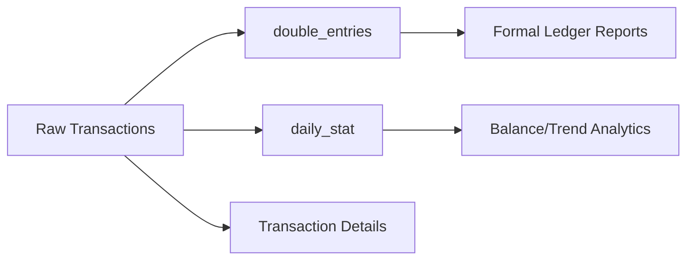

# Analytics Overview

Capabilities and approach for querying financial data in Go Money.

## Analytics Architecture



## Data Sources for Analytics

### 1. transactions Table

**Best for:**
- Transaction details and search
- Category/tag analysis
- Recent activity
- Title-based queries
- Date-filtered analysis

**Considerations:**
- Contains all fields
- Requires JOINs for account/category names
- Can be slow for large date ranges

### 2. daily_stat Table

**Best for:**
- Balance history
- Running totals
- Net worth over time
- Performance-critical queries

**Considerations:**
- Pre-computed running balances
- No transaction details
- Very fast for time series

### 3. double_entries Table

**Best for:**
- Formal accounting reports
- Trial balance
- Account reconciliation
- Audit trails

**Considerations:**
- Double-entry format (debit/credit)
- Amounts always in base currency
- One debit + one credit per transaction

## Key Concepts

### Transaction Types

| Value | Name | Query Filter |
|-------|------|--------------|
| 1 | Transfer | `transaction_type = 1` |
| 2 | Income | `transaction_type = 2` |
| 3 | Expense | `transaction_type = 3` |
| 5 | Adjustment | `transaction_type = 5` |

### Account Types

| Value | Name | Net Worth Impact |
|-------|------|------------------|
| 1 | Asset | Positive (+) |
| 4 | Liability | Negative (-) |
| 5 | Expense | Tracking only |
| 6 | Income | Tracking only |
| 7 | Adjustment | N/A |

### Amount Fields

| Field | Usage |
|-------|-------|
| source_amount | Original currency, source account |
| destination_amount | Original currency, destination account |
| source_amount_in_base_currency | Converted, always negative |
| destination_amount_in_base_currency | Converted, always positive |

## Common Query Patterns

### Date Filtering

```sql
-- This month
WHERE DATE_TRUNC('month', transaction_date_only) = DATE_TRUNC('month', CURRENT_DATE)

-- Last 30 days
WHERE transaction_date_only >= CURRENT_DATE - INTERVAL '30 days'

-- This year
WHERE EXTRACT(YEAR FROM transaction_date_only) = EXTRACT(YEAR FROM CURRENT_DATE)

-- Date range
WHERE transaction_date_only BETWEEN :start_date AND :end_date
```

### Soft Delete Handling

Always include:
```sql
WHERE deleted_at IS NULL
```

### Array Field (Tags)

```sql
-- Find by tag
WHERE :tag_id = ANY(tag_ids)

-- Has any of multiple tags
WHERE tag_ids && ARRAY[:tag1, :tag2]

-- Has all of multiple tags
WHERE tag_ids @> ARRAY[:tag1, :tag2]
```

### Aggregation with Time

```sql
-- Daily
GROUP BY transaction_date_only

-- Weekly
GROUP BY DATE_TRUNC('week', transaction_date_only)

-- Monthly
GROUP BY DATE_TRUNC('month', transaction_date_only)
```

## Performance Guidelines

### When to Use Each Table

| Query Type | Recommended Table |
|------------|-------------------|
| Current balance | accounts.current_balance |
| Balance at date | daily_stat |
| Balance history | daily_stat |
| Transaction list | transactions |
| Category breakdown | transactions + categories |
| Tag analysis | transactions + tags |
| Formal ledger | double_entries |
| Net worth trend | daily_stat |

### Index Usage

Key indexes for common queries:

| Query Type | Index Used |
|------------|------------|
| By date | ix_transaction_date_only |
| By account | ix_source_account, ix_dest_account |
| By type + date | ix_type_date_only |
| By category | ix_category_id |
| Daily stats | daily_stat_pk |
| Double entries | ix_double_entries_transaction_date |

### Query Optimization Tips

1. **Filter early**: Apply WHERE clauses before JOINs when possible
2. **Use date ranges**: Always limit date ranges for large tables
3. **Prefer daily_stat**: For balance/trend queries
4. **Limit results**: Use LIMIT for exploratory queries
5. **Avoid SELECT ***: Only select needed columns

## Documentation Files

- [Common Queries](common-queries.md) - 25+ ready-to-use queries
- [Balance Queries](query-patterns/balance-queries.md) - Account and net worth queries
- [Transaction Queries](query-patterns/transaction-queries.md) - Listing and filtering
- [Category Analysis](query-patterns/category-analysis.md) - Spending by category
- [Tag Analysis](query-patterns/tag-analysis.md) - Tag-based analysis
- [Time Series](query-patterns/time-series.md) - Trends and comparisons
- [Performance Tips](performance-tips.md) - Query optimization

## Multi-Currency Considerations

### Converting to Base Currency

Use the `*_in_base_currency` fields for consistent reporting:

```sql
SUM(destination_amount_in_base_currency)  -- Correct
SUM(destination_amount)                    -- Currency-mixed!
```

### Per-Currency Analysis

For currency-specific analysis:

```sql
SELECT
    source_currency,
    SUM(ABS(source_amount)) as total
FROM transactions
GROUP BY source_currency;
```

## Example Analytics Questions

| Question | Approach |
|----------|----------|
| "What's my net worth?" | Sum assets - liabilities from accounts |
| "How much did I spend last month?" | Filter expenses by date, sum base amount |
| "Top expense categories?" | Group by category, sum, order by total |
| "Spending trend over time?" | Use daily_stat or group transactions by date |
| "Balance history?" | Query daily_stat for account |
| "Is my ledger balanced?" | Sum debits vs credits in double_entries |
